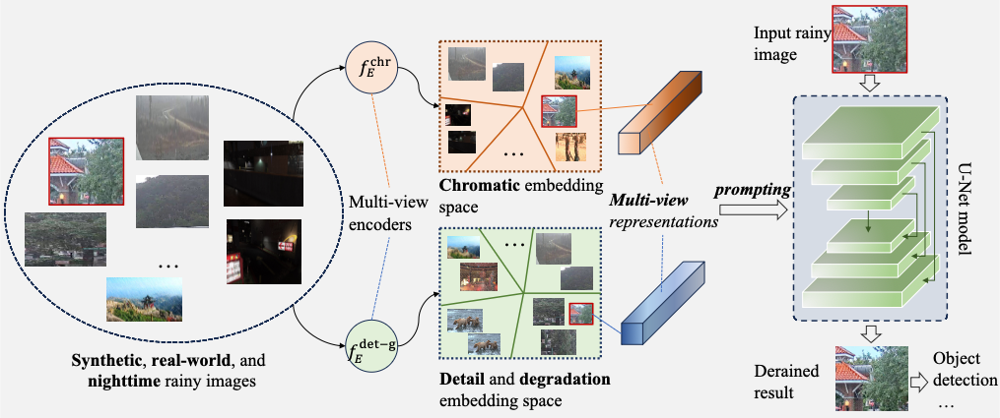

# Rainmer: Learning multi-view representations for comprehensive image deraining and beyond

The official pytorch implementation of the paper **[Rainmer (ACMMM 2024)](https://dl.acm.org/doi/proceedings/10.1145/3664647)**

>    **Abstract**: We address image deraining under complex backgrounds, diverse rain scenarios, and varying illumination conditions, representing a highly practical and challenging problem. Our approach utilizes synthetic, real-world, and nighttime datasets, wherein rich backgrounds, multiple degradation types, and diverse illumination conditions coexist. The primary challenge in training models on these datasets arises from the discrepancies among them, potentially leading to conflicts or competition during the training period. To address this issue, we first align the distribution of synthetic, real-world and nighttime datasets. Then we propose a novel contrastive learning strategy to extract multi-view (multiple) representations that effectively capture image details, degradations, and illuminations, thereby facilitating training across all datasets. Regarding multiple representations as profitable prompts for deraining, we devise a prompting strategy to integrate them into the decoding process. This contributes to a potent deraining model, dubbed Rainmer. Additionally, a spatial-channel interaction module is introduced to fully exploit cues when extracting multi-view representations. Extensive experiments on synthetic, real-world, and nighttime datasets demonstrate that Rainmer outperforms current representative methods. Moreover, Rainmer achieves superior performance on the All-in-One image restoration dataset, underscoring its effectiveness. Furthermore, quantitative results reveal that Rainmer significantly improves object detection performance on both daytime and night-time rainy datasets. These observations substantiate the potential of Rainmer for practical applications.

**TLDR**: *This paper developed a representation-based method to process rainy images under synthetic, real-world, and night-time conditions.*

## Architecture



## Results

**Derain** (more results can be found in the original paper)


**Detection**


**Relation between derain and detection**


| Dataset (mixed) | Rain100L | Rain100H | Test100 | Test1200 | Test2800 | GT-Rain | GTAV-balance | Avg    |
| --------------- | -------- | -------- | ------- | -------- | -------- | ------- | ------------ | ------ |
| PSNR            | 36.42    | 29.38    | 29.86   | 31.98    | 33.22    | 23.17   | 35.42        | 31.35  |
| SSIM            | 0.9669   | 0.8775   | 0.9171  | 0.9377   | 0.9543   | 0.6594  | 0.9631       | 0.8966 |

## Datasets

- Rain13K 
- GT-Rain
- GTAV-NightRain

## Citation

If Rainmer helps your research or work, please consider citing this paper.

```

```


## Contact

If you have any questions, please contact [e-mail](wran21@m.fudan.edu.cn).
